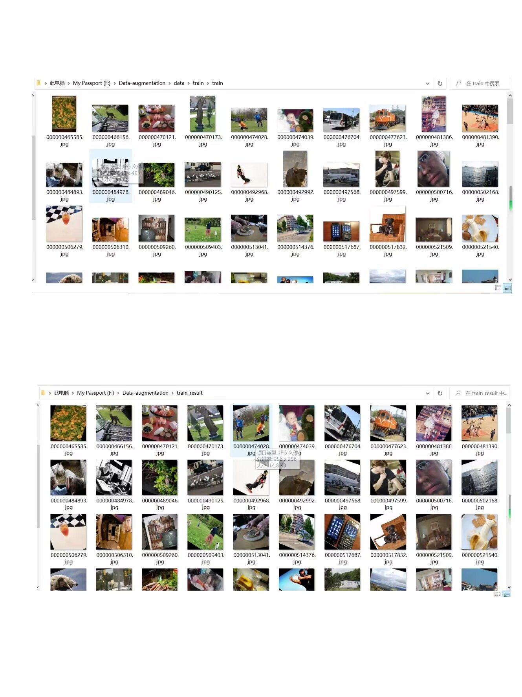

# Data augmentation
随机水平翻转即将图像沿着垂直中心轴进行翻转，这样的操作可以增加数据的多样性，增强模型的泛化能力。水平随机翻转可以解决旋转不变性的视觉问题。它通过对图像进行水平翻转，使模型能够学习到具有旋转不变性的特征。

随机旋转是一种数据增强的操作，它可以将原始图像在一定角度范围内进行旋转，从而生成新的图像数据。具体地，随机旋转会在一个角度范围内随机采样一个角度值，然后将原始图像绕图像中心点进行旋转，生成一张旋转后的图像。这样可以增加数据集的多样性。随机旋转可以解决旋转不变性的视觉问题。

随机裁切是一种常用的数据增强技术，它会对输入图像进行随机裁剪，这样可以增加数据的多样性，并且可以减小过拟合的风险。它是在原始图像中随机选取一个区域，然后将该区域作为新的图像输出，可以通过指定裁切的大小和比例来控制裁切的程度和方向，从而实现不同的数据增广效果。随机裁切可以解决平移不变性的视觉问题。

随机色度变换指在一定程度上改变输入的图像的颜色。常见的色度变换包括改变图像的亮度、饱和度和对比度等。在随机色度变换中，每个变换的参数都被随机生成。使模型能够学习到具有光照复杂性的特征，从而提高模型的泛化能力。随机色度变换可以解决光照复杂性的视觉问题。


## Approach




## Usage

Here we apply the environment required by clip
First, [install PyTorch 1.8.1](https://pytorch.org/get-started/locally/) (or later) and torchvision. On a CUDA GPU machine, the following will do the trick:

```bash
$ conda install --yes -c pytorch pytorch=1.7.1 torchvision cudatoolkit=10.2
$ pip install ftfy regex tqdm
$ pip install git+https://github.com/openai/CLIP.git
```

## More Examples

### Single image data expansion


```python
import os
import torch
import torchvision.transforms as transforms
from PIL import Image
# 定义数据增强函数
transform = transforms.Compose([
    transforms.RandomHorizontalFlip(p=0.5),
    transforms.RandomRotation(degrees=(-30, 30), expand=False),
    transforms.RandomResizedCrop(size=256, scale=(0.8, 1.0), ratio=(0.8, 1.2)),])
# 加载文件夹
image_folder = 'F:\\classification-basic-sample-master\\data\\train\\train'
# 获取文件夹中的所有图片文件名
image_filenames = os.listdir(image_folder)
# 定义保存增强后图片的文件夹路径
output_folder = 'F:\\classification-basic-sample-master\\train_result'
if not os.path.exists(output_folder):
    os.makedirs(output_folder)
# 对每张图片进行增强
for image_filename in image_filenames:
    # 加载图片
    image_path = os.path.join(image_folder, image_filename)
    image = Image.open(image_path)
    # 对图片进行增强
    augmented_image = transform(image)
    # 保存增强后的图片
    output_path = os.path.join(output_folder, image_filename)
    augmented_image.save(output_path)
```

The processed image here will be saved in 'train_Data Set result'picture

