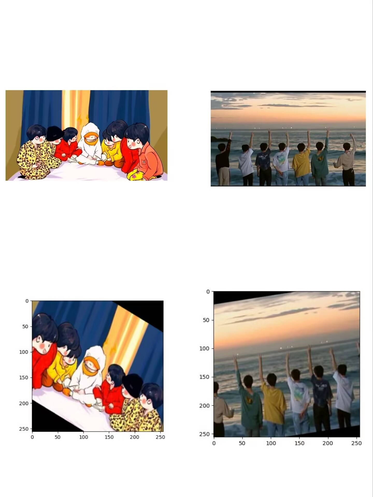

# Data augmentation


C.

## Approach




## Usage

Here we apply the environment required by clip
First, [install PyTorch 1.8.1](https://pytorch.org/get-started/locally/) (or later) and torchvision. On a CUDA GPU machine, the following will do the trick:

```bash
$ conda install --yes -c pytorch pytorch=1.7.1 torchvision cudatoolkit=10.2
$ pip install ftfy regex tqdm
$ pip install git+https://github.com/openai/CLIP.git
```

## More Examples

### Single image data expansion


```python
import torch
import torchvision.transforms as transforms
from PIL import Image
# 定义数据增广函数
transform = transforms.Compose([
    transforms.RandomHorizontalFlip(p=0.5),
    transforms.RandomRotation(degrees=(-30, 30), expand=False),
    transforms.RandomResizedCrop(size=256, scale=(0.8, 1.0), ratio=(0.8, 1.2)),
    transforms.ToTensor(),
])
# 加载训练集单张图片
train_image = Image.open(r'F:\Data-augmentation\data\train\TNT.jpg')
# 对图片进行增广
augmented_image = transform(train_image)
# 显示增广后的图片
import matplotlib.pyplot as plt
plt.imshow(augmented_image.permute(1, 2, 0))
plt.show()
# 加载验证集单张图片
val_image = Image.open(r'F:\Data-augmentation\data\val\Boom.jpg')
# 对图片进行增广
augmented_image = transform(val_image)
# 显示增广后的图片
import matplotlib.pyplot as plt
plt.imshow(augmented_image.permute(1, 2, 0))
plt.show()
```

The processed image here will be saved in 'result'picture

